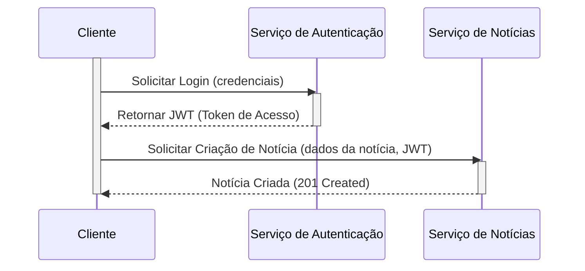

# pynewsserver
Serviço de Noticas e Bibliotecas PyNews

## 💡 Visão Geral

## 💻 Tecnologias Utilizadas
    - Python 
        - FastAPI 
        - Pydantic
        - Poetry
        - Sqlite3
        - Orjson
        - ruff (linter)

## 🚀 Recursos e Funcionalidades
    Endpoints para CRUD de noticias selecionadas pela comunidade. 

### Schema da API
    [Documentação de referencia API Dog](https://apidog.com/apidoc/shared/70418cab-ddba-4c7d-97a4-8b70b43a7946/)
<div class="px-2 pb-2 pt-5 os:px-5 os:pb-10 _tree-scroll-container relative h-full w-full overflow-y-auto"><ul class="w-full"><li><div to="" class="_sidebar-tree-node_13jsg_1 cursor-pointer select-none font-600 text-color" title="Authentication"><span class="break-word">Authentication</span><div class="flex-1"></div><div class="flex h-[22px] w-[22px] items-center justify-center"><span role="img" class="appicon app_icon text-disabled" style="font-size:16px"><svg viewBox="0 0 1024 1024" width="1em" height="1em" fill="currentColor" aria-hidden="true" focusable="false" role="img"><path d="M225.834667 353.834667a42.666667 42.666667 0 0 1 60.330666 0L512 579.669333l225.834667-225.834666a42.666667 42.666667 0 1 1 60.330666 60.330666l-256 256a42.666667 42.666667 0 0 1-60.330666 0l-256-256a42.666667 42.666667 0 0 1 0-60.330666z"></path></svg></span></div></div><ul class="ml-3 border-l border-color-split pl-2"><li><a class="_sidebar-tree-node_13jsg_1 _sidebar-tree-node--selected_13jsg_24 font-600 sidebar-tree-node-apiDetail-15916580" title="Athenticate" data-discover="true" href="https://apidog.com/apidoc/shared/70418cab-ddba-4c7d-97a4-8b70b43a7946/athenticate-15916580e0"><span class="break-word">Athenticate</span><span class="ui-badge ui-badge-status ui-badge-not-a-wrapper ml-1 opacity-40"><span class="ui-badge-status-dot ui-badge-status-blue"></span></span><div class="flex-1"></div><span class="inline-flex items-center h-[14px] rounded-full px-1 py-0.5 text-xs font-700 leading-[10px] bg-orange-6 text-white ml-2 mt-1 max-w-[70px]"><span class="truncate">POST</span></span></a></li></ul></li><li><div to="" class="_sidebar-tree-node_13jsg_1 cursor-pointer select-none text-color" title="News"><span class="break-word">News</span><div class="flex-1"></div><div class="flex h-[22px] w-[22px] items-center justify-center"><span role="img" class="appicon app_icon text-disabled" style="font-size:16px"><svg viewBox="0 0 1024 1024" width="1em" height="1em" fill="currentColor" aria-hidden="true" focusable="false" role="img"><path d="M225.834667 353.834667a42.666667 42.666667 0 0 1 60.330666 0L512 579.669333l225.834667-225.834666a42.666667 42.666667 0 1 1 60.330666 60.330666l-256 256a42.666667 42.666667 0 0 1-60.330666 0l-256-256a42.666667 42.666667 0 0 1 0-60.330666z"></path></svg></span></div></div><ul class="ml-3 border-l border-color-split pl-2"><li><a class="_sidebar-tree-node_13jsg_1" title="Create" data-discover="true" href="https://apidog.com/apidoc/shared/70418cab-ddba-4c7d-97a4-8b70b43a7946/create-15876459e0"><span class="break-word">Create</span><span class="ui-badge ui-badge-status ui-badge-not-a-wrapper ml-1 opacity-40"><span class="ui-badge-status-dot ui-badge-status-blue"></span></span><div class="flex-1"></div><span class="inline-flex items-center h-[14px] rounded-full px-1 py-0.5 text-xs font-700 leading-[10px] bg-orange-1 text-orange-6 ml-2 mt-1 max-w-[70px]"><span class="truncate">POST</span></span></a></li><li><a class="_sidebar-tree-node_13jsg_1" title="Get" data-discover="true" href="https://apidog.com/apidoc/shared/70418cab-ddba-4c7d-97a4-8b70b43a7946/get-15876866e0"><span class="break-word">Get</span><span class="ui-badge ui-badge-status ui-badge-not-a-wrapper ml-1 opacity-40"><span class="ui-badge-status-dot ui-badge-status-blue"></span></span><div class="flex-1"></div><span class="inline-flex items-center h-[14px] rounded-full px-1 py-0.5 text-xs font-700 leading-[10px] bg-green-1 text-green-6 ml-2 mt-1 max-w-[70px]"><span class="truncate">GET</span></span></a></li><li><a class="_sidebar-tree-node_13jsg_1" title="Update" data-discover="true" href="https://apidog.comhttps://apidog.com/apidoc/shared/70418cab-ddba-4c7d-97a4-8b70b43a7946/update-15878592e0"><span class="break-word">Update</span><span class="ui-badge ui-badge-status ui-badge-not-a-wrapper ml-1 opacity-40"><span class="ui-badge-status-dot ui-badge-status-blue"></span></span><div class="flex-1"></div><span class="inline-flex items-center h-[14px] rounded-full px-1 py-0.5 text-xs font-700 leading-[10px] bg-blue-1 text-blue-6 ml-2 mt-1 max-w-[70px]"><span class="truncate">PUT</span></span></a></li><li><a class="_sidebar-tree-node_13jsg_1" title="Like" data-discover="true" href="https://apidog.comhttps://apidog.com/apidoc/shared/70418cab-ddba-4c7d-97a4-8b70b43a7946/like-15961454e0"><span class="break-word">Like</span><span class="ui-badge ui-badge-status ui-badge-not-a-wrapper ml-1 opacity-40"><span class="ui-badge-status-dot ui-badge-status-blue"></span></span><div class="flex-1"></div><span class="inline-flex items-center h-[14px] rounded-full px-1 py-0.5 text-xs font-700 leading-[10px] bg-orange-1 text-orange-6 ml-2 mt-1 max-w-[70px]"><span class="truncate">POST</span></span></a></li></ul></li><li><div to="" class="_sidebar-tree-node_13jsg_1 cursor-pointer select-none text-color" title="Libraries"><span class="break-word">Libraries</span><div class="flex-1"></div><div class="flex h-[22px] w-[22px] items-center justify-center"><span role="img" class="appicon app_icon text-disabled" style="font-size:16px"><svg viewBox="0 0 1024 1024" width="1em" height="1em" fill="currentColor" aria-hidden="true" focusable="false" role="img"><path d="M225.834667 353.834667a42.666667 42.666667 0 0 1 60.330666 0L512 579.669333l225.834667-225.834666a42.666667 42.666667 0 1 1 60.330666 60.330666l-256 256a42.666667 42.666667 0 0 1-60.330666 0l-256-256a42.666667 42.666667 0 0 1 0-60.330666z"></path></svg></span></div></div><ul class="ml-3 border-l border-color-split pl-2"><li><a class="_sidebar-tree-node_13jsg_1" title="Create Subscription" data-discover="true" href="https://apidog.com/apidoc/shared/70418cab-ddba-4c7d-97a4-8b70b43a7946/create-subscription-16489942e0"><span class="break-word">Create Subscription</span><span class="ui-badge ui-badge-status ui-badge-not-a-wrapper ml-1 opacity-40"><span class="ui-badge-status-dot ui-badge-status-blue"></span></span><div class="flex-1"></div><span class="inline-flex items-center h-[14px] rounded-full px-1 py-0.5 text-xs font-700 leading-[10px] bg-orange-1 text-orange-6 ml-2 mt-1 max-w-[70px]"><span class="truncate">POST</span></span></a></li><li><a class="_sidebar-tree-node_13jsg_1" title="Add new Library" data-discover="true" href="/apidoc/shared/70418cab-ddba-4c7d-97a4-8b70b43a7946/add-new-library-16489959e0"><span class="break-word">Add new Library</span><span class="ui-badge ui-badge-status ui-badge-not-a-wrapper ml-1 opacity-40"><span class="ui-badge-status-dot ui-badge-status-blue"></span></span><div class="flex-1"></div><span class="inline-flex items-center h-[14px] rounded-full px-1 py-0.5 text-xs font-700 leading-[10px] bg-orange-1 text-orange-6 ml-2 mt-1 max-w-[70px]"><span class="truncate">POST</span></span></a></li><li><a class="_sidebar-tree-node_13jsg_1" title="GET List of the last 30 days updates " data-discover="true" href="https://apidog.com/apidoc/shared/70418cab-ddba-4c7d-97a4-8b70b43a7946/get-list-of-the-last-30-days-updates-16490481e0"><span class="break-word">GET List of the last 30 days updates </span><span class="ui-badge ui-badge-status ui-badge-not-a-wrapper ml-1 opacity-40"><span class="ui-badge-status-dot ui-badge-status-blue"></span></span><div class="flex-1"></div><span class="inline-flex items-center h-[14px] rounded-full px-1 py-0.5 text-xs font-700 leading-[10px] bg-green-1 text-green-6 ml-2 mt-1 max-w-[70px]"><span class="truncate">GET</span></span></a></li></ul></li></ul></div>

---

### Schema do Servidor 
```
    fastapi_news_service/
    │
    ├── app/
    │   ├── __init__.py           # Marca 'app' como um pacote Python
    │   ├── main.py               # Ponto de entrada principal da aplicação FastAPI e inclusão dos routers
    │   ├── schemas.py            # Definições dos modelos Pydantic para todas as entidades (User, News, Library, Subscription)
    │   │
    │   ├── services/
    │   │   ├── __init__.py       # Marca 'services' como um pacote Python
    │   │   ├── database.py       # Lógica de conexão e gerenciamento de sessão com o banco de dados (SQLAlchemy/SQLModel)
    │   │   ├── auth.py           # Lógica de negócio para autenticação (hashing de senhas, geração/validação de JWT)
    │   │
    │   └── routers/
    │       ├── __init__.py       # Marca 'routers' como um pacote Python
    │       ├── news.py           # Definição dos endpoints da API para o módulo de Notícias (/news)
    │       ├── libraries.py      # Definição dos endpoints da API para o módulo de Libraries (/libraries)
    │       └── authentication.py # Definição dos endpoints da API para o módulo de Autenticação (/auth)
    │
    ├── test/                     # Diretório para testes unitários 
    │   └── __init__.py
    │   └── test_auth.py
    │   └── test_news.py
    │   └── test_libraries.py
    │
    ├── .env                      # Arquivo para variáveis de ambiente (ex: credenciais do banco de dados, chave secreta JWT)
    ├── .gitignore                # Regras para ignorar arquivos e diretórios no controle de versão (Git)
    ├── requirements.txt          # Lista das dependências Python do projeto
    ├── Dockerfile                # Definição para construir a imagem Docker da aplicação
    ├── docker-compose.yaml       # Configuração para orquestrar serviços Docker (API, banco de dados)
    ├── Makefile                  # Utilitário para automação de tarefas (build, deploy, etc., incluindo scripts para Kubernetes)
    ├── pyproject.toml            # Configuração de projeto Python (Poetry)
    ├── README.md                 # Este arquivo: Visão geral do projeto, instruções de configuração e uso
    └── .vscode/                  # Configurações específicas para o ambiente de desenvolvimento VS Code
       ├── settings.json          # Configurações de formatação, linting, etc.
       └── launch.json            # Configurações para depuração da aplicação
```



## ⚙️ Como Rodar

### 📋 Pré-requisitos
- Docker e Docker Compose instalados
- Git (para clonar o repositório)

### 🚀 Início Rápido

1. **Clone o repositório:**
   ```bash
   git clone <repository-url>
   cd PyNewsServer
   ```

2. **Configure as variáveis de ambiente (opcional):**
   ```bash
   cp .env.example .env
   # Edite o arquivo .env conforme necessário
   ```

3. **Inicie o serviço:**
   ```bash
   docker-compose up -d
   ```

4. **Acesse a aplicação:**
   - API: http://localhost:8000
   - Documentação Swagger: http://localhost:8000/docs
   - Health Check: http://localhost:8000/api/healthcheck

## 🧩 Configuração Inicial

### ▶️ Guia de Execução para Desenvolvimento

#### Usando Docker (Recomendado)
```bash
# Construir e iniciar em modo desenvolvimento
docker-compose up --build

# Ver logs em tempo real
docker-compose logs -f pynews-api

# Parar o serviço
docker-compose down
```

#### Usando Poetry (Local)
```bash
# Instalar dependências
poetry install

# Ativar ambiente virtual
poetry shell

# Rodar a aplicação
uvicorn app.main:app --host 0.0.0.0 --port 8000 --reload

# Rodar testes
poetry run pytest

# Linting
poetry run ruff check .
poetry run ruff format .
```

### ▶️ Guia de Execução para Produção

```bash
# Construir imagem para produção
docker-compose build --target production

# Iniciar em modo produção
docker-compose up -d

# Verificar status dos containers
docker-compose ps

# Ver logs
docker-compose logs pynews-api

# Atualizar aplicação
docker-compose pull
docker-compose up -d --force-recreate
```

### 🔧 Comandos Úteis

#### Usando Makefile (Recomendado)
```bash
# Ver todos os comandos disponíveis
make help

# Setup completo do projeto
make setup

# Ambiente de desenvolvimento
make dev

# Construir e iniciar
make build
make up

# Ver logs
make logs

# Executar testes
make test
make test-cov

# Linting e formatação
make lint
make format

# Verificar saúde da API
make health

# Parar serviços
make down

# Limpeza completa
make clean
```

#### Comandos Docker Diretos
```bash
# Entrar no container
docker-compose exec pynews-api bash

# Reiniciar apenas o serviço da API
docker-compose restart pynews-api

# Verificar health check
curl http://localhost:8000/api/healthcheck

# Parar e remover todos os containers e volumes
docker-compose down -v
```

### 🛠️ Desenvolvimento

#### Estrutura de Testes
```bash
# Rodar todos os testes
poetry run pytest

# Rodar testes com coverage
poetry run pytest --cov=app

# Rodar testes específicos
poetry run pytest tests/test_auth.py
```

#### Linting e Formatação
```bash
# Verificar código
poetry run ruff check .

# Formatar código
poetry run ruff format .

# Fix automático de problemas
poetry run ruff check . --fix
```

 
## referencias 
    [Opinion based fastapi best practices](https://github.com/zhanymkanov/fastapi-best-practices)
