# pynewsserver
Serviço de Noticas e Bibliotecas PyNews

## 💡 Visão Geral

## 💻 Tecnologias Utilizadas
    - Python 
        - FastAPI 
        - Pydantic

## 🚀 Recursos e Funcionalidades
    Endpoints para CRUD de noticias selecionadas pela comunidade. 

### Schema da API
    [Documentação de referencia API Dog](https://apidog.com/apidoc/shared/70418cab-ddba-4c7d-97a4-8b70b43a7946/)
<div class="px-2 pb-2 pt-5 os:px-5 os:pb-10 _tree-scroll-container relative h-full w-full overflow-y-auto"><ul class="w-full"><li><div to="" class="_sidebar-tree-node_13jsg_1 cursor-pointer select-none font-600 text-color" title="Authentication"><span class="break-word">Authentication</span><div class="flex-1"></div><div class="flex h-[22px] w-[22px] items-center justify-center"><span role="img" class="appicon app_icon text-disabled" style="font-size:16px"><svg viewBox="0 0 1024 1024" width="1em" height="1em" fill="currentColor" aria-hidden="true" focusable="false" role="img"><path d="M225.834667 353.834667a42.666667 42.666667 0 0 1 60.330666 0L512 579.669333l225.834667-225.834666a42.666667 42.666667 0 1 1 60.330666 60.330666l-256 256a42.666667 42.666667 0 0 1-60.330666 0l-256-256a42.666667 42.666667 0 0 1 0-60.330666z"></path></svg></span></div></div><ul class="ml-3 border-l border-color-split pl-2"><li><a class="_sidebar-tree-node_13jsg_1 _sidebar-tree-node--selected_13jsg_24 font-600 sidebar-tree-node-apiDetail-15916580" title="Athenticate" data-discover="true" href="/apidoc/shared/70418cab-ddba-4c7d-97a4-8b70b43a7946/athenticate-15916580e0"><span class="break-word">Athenticate</span><span class="ui-badge ui-badge-status ui-badge-not-a-wrapper ml-1 opacity-40"><span class="ui-badge-status-dot ui-badge-status-blue"></span></span><div class="flex-1"></div><span class="inline-flex items-center h-[14px] rounded-full px-1 py-0.5 text-xs font-700 leading-[10px] bg-orange-6 text-white ml-2 mt-1 max-w-[70px]"><span class="truncate">POST</span></span></a></li></ul></li><li><div to="" class="_sidebar-tree-node_13jsg_1 cursor-pointer select-none text-color" title="News"><span class="break-word">News</span><div class="flex-1"></div><div class="flex h-[22px] w-[22px] items-center justify-center"><span role="img" class="appicon app_icon text-disabled" style="font-size:16px"><svg viewBox="0 0 1024 1024" width="1em" height="1em" fill="currentColor" aria-hidden="true" focusable="false" role="img"><path d="M225.834667 353.834667a42.666667 42.666667 0 0 1 60.330666 0L512 579.669333l225.834667-225.834666a42.666667 42.666667 0 1 1 60.330666 60.330666l-256 256a42.666667 42.666667 0 0 1-60.330666 0l-256-256a42.666667 42.666667 0 0 1 0-60.330666z"></path></svg></span></div></div><ul class="ml-3 border-l border-color-split pl-2"><li><a class="_sidebar-tree-node_13jsg_1" title="Create" data-discover="true" href="/apidoc/shared/70418cab-ddba-4c7d-97a4-8b70b43a7946/create-15876459e0"><span class="break-word">Create</span><span class="ui-badge ui-badge-status ui-badge-not-a-wrapper ml-1 opacity-40"><span class="ui-badge-status-dot ui-badge-status-blue"></span></span><div class="flex-1"></div><span class="inline-flex items-center h-[14px] rounded-full px-1 py-0.5 text-xs font-700 leading-[10px] bg-orange-1 text-orange-6 ml-2 mt-1 max-w-[70px]"><span class="truncate">POST</span></span></a></li><li><a class="_sidebar-tree-node_13jsg_1" title="Get" data-discover="true" href="/apidoc/shared/70418cab-ddba-4c7d-97a4-8b70b43a7946/get-15876866e0"><span class="break-word">Get</span><span class="ui-badge ui-badge-status ui-badge-not-a-wrapper ml-1 opacity-40"><span class="ui-badge-status-dot ui-badge-status-blue"></span></span><div class="flex-1"></div><span class="inline-flex items-center h-[14px] rounded-full px-1 py-0.5 text-xs font-700 leading-[10px] bg-green-1 text-green-6 ml-2 mt-1 max-w-[70px]"><span class="truncate">GET</span></span></a></li><li><a class="_sidebar-tree-node_13jsg_1" title="Update" data-discover="true" href="/apidoc/shared/70418cab-ddba-4c7d-97a4-8b70b43a7946/update-15878592e0"><span class="break-word">Update</span><span class="ui-badge ui-badge-status ui-badge-not-a-wrapper ml-1 opacity-40"><span class="ui-badge-status-dot ui-badge-status-blue"></span></span><div class="flex-1"></div><span class="inline-flex items-center h-[14px] rounded-full px-1 py-0.5 text-xs font-700 leading-[10px] bg-blue-1 text-blue-6 ml-2 mt-1 max-w-[70px]"><span class="truncate">PUT</span></span></a></li><li><a class="_sidebar-tree-node_13jsg_1" title="Like" data-discover="true" href="/apidoc/shared/70418cab-ddba-4c7d-97a4-8b70b43a7946/like-15961454e0"><span class="break-word">Like</span><span class="ui-badge ui-badge-status ui-badge-not-a-wrapper ml-1 opacity-40"><span class="ui-badge-status-dot ui-badge-status-blue"></span></span><div class="flex-1"></div><span class="inline-flex items-center h-[14px] rounded-full px-1 py-0.5 text-xs font-700 leading-[10px] bg-orange-1 text-orange-6 ml-2 mt-1 max-w-[70px]"><span class="truncate">POST</span></span></a></li></ul></li><li><div to="" class="_sidebar-tree-node_13jsg_1 cursor-pointer select-none text-color" title="Libraries"><span class="break-word">Libraries</span><div class="flex-1"></div><div class="flex h-[22px] w-[22px] items-center justify-center"><span role="img" class="appicon app_icon text-disabled" style="font-size:16px"><svg viewBox="0 0 1024 1024" width="1em" height="1em" fill="currentColor" aria-hidden="true" focusable="false" role="img"><path d="M225.834667 353.834667a42.666667 42.666667 0 0 1 60.330666 0L512 579.669333l225.834667-225.834666a42.666667 42.666667 0 1 1 60.330666 60.330666l-256 256a42.666667 42.666667 0 0 1-60.330666 0l-256-256a42.666667 42.666667 0 0 1 0-60.330666z"></path></svg></span></div></div><ul class="ml-3 border-l border-color-split pl-2"><li><a class="_sidebar-tree-node_13jsg_1" title="Create Subscription" data-discover="true" href="/apidoc/shared/70418cab-ddba-4c7d-97a4-8b70b43a7946/create-subscription-16489942e0"><span class="break-word">Create Subscription</span><span class="ui-badge ui-badge-status ui-badge-not-a-wrapper ml-1 opacity-40"><span class="ui-badge-status-dot ui-badge-status-blue"></span></span><div class="flex-1"></div><span class="inline-flex items-center h-[14px] rounded-full px-1 py-0.5 text-xs font-700 leading-[10px] bg-orange-1 text-orange-6 ml-2 mt-1 max-w-[70px]"><span class="truncate">POST</span></span></a></li><li><a class="_sidebar-tree-node_13jsg_1" title="Add new Library" data-discover="true" href="/apidoc/shared/70418cab-ddba-4c7d-97a4-8b70b43a7946/add-new-library-16489959e0"><span class="break-word">Add new Library</span><span class="ui-badge ui-badge-status ui-badge-not-a-wrapper ml-1 opacity-40"><span class="ui-badge-status-dot ui-badge-status-blue"></span></span><div class="flex-1"></div><span class="inline-flex items-center h-[14px] rounded-full px-1 py-0.5 text-xs font-700 leading-[10px] bg-orange-1 text-orange-6 ml-2 mt-1 max-w-[70px]"><span class="truncate">POST</span></span></a></li><li><a class="_sidebar-tree-node_13jsg_1" title="GET List of the last 30 days updates " data-discover="true" href="/apidoc/shared/70418cab-ddba-4c7d-97a4-8b70b43a7946/get-list-of-the-last-30-days-updates-16490481e0"><span class="break-word">GET List of the last 30 days updates </span><span class="ui-badge ui-badge-status ui-badge-not-a-wrapper ml-1 opacity-40"><span class="ui-badge-status-dot ui-badge-status-blue"></span></span><div class="flex-1"></div><span class="inline-flex items-center h-[14px] rounded-full px-1 py-0.5 text-xs font-700 leading-[10px] bg-green-1 text-green-6 ml-2 mt-1 max-w-[70px]"><span class="truncate">GET</span></span></a></li></ul></li></ul></div>

---

### Schema do Servidor 
    ```
    fastapi_news_service/
    │
    ├── app/
    │   ├── __init__.py
    │   ├── main.py            # Ponto de entrada da aplicação FastAPI e inclusão dos routers
    │   ├── models.py         # Modelos da base de dados ( User, News, NewsLibrary)
    │   ├── schemas.py        # Esquemas Pydantic para todas as entidades (News, NewsLibrary, User, Token)
    │   ├── crud.py           # Funções CRUD para todas as entidades
    │   ├── auth.py           # Lógica de autenticação (JWT) e dependências (get_current_user)
    │   ├── config.py         # Carregamento de configurações a partir do .env
    │   ├── database.py       # Configuração da conexão com o banco de dados
    │   │
    │   └── routers/
    │       ├── __init__.py
    │       ├── news.py         # Endpoints para /news (receber do scraper, buscar)
    │       ├── libraries.py    # Endpoints para /libraries (criar/gerenciar bibliotecas de notícias)
    │       └── authentication.py        # Endpoint para /login (autenticação do usuário)
    │
    ├── .env                      # Arquivo para variáveis de ambiente
    ├── .gitignore
    ├── requirements.txt
    └── README.md
    ```


```mermaid
graph TD
    subgraph "Cliente"
        Client[Usuário / Aplicação Cliente]
    end

    subgraph "Serviços da API"
        Auth["Auth </br> (Autenticação e Autorização)"]
        Schema["Schema </br> (Validação de Dados Pydantic)"]
        News["News </br> (Endpoint /news)"]
        Library["Library </br> (Endpoint /libraries)"]
    end

    %% Fluxo de Interação
    Client -->Auth
    Auth ----> Client
    Client ----> News
    Client ----> Library
    News ----> Schema
    Library ----> Schema
```

## ⚙️ Como Rodar
    [TBD]
## 🧩 Configuração Inicial

### ▶️ Guia de Execução Dev 

### ▶️ Guia de Execução Prod

 
## referencias 
    [Opinion based fastapi best practices](https://github.com/zhanymkanov/fastapi-best-practices)
